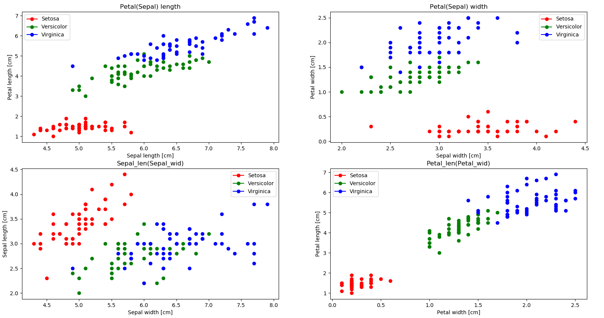
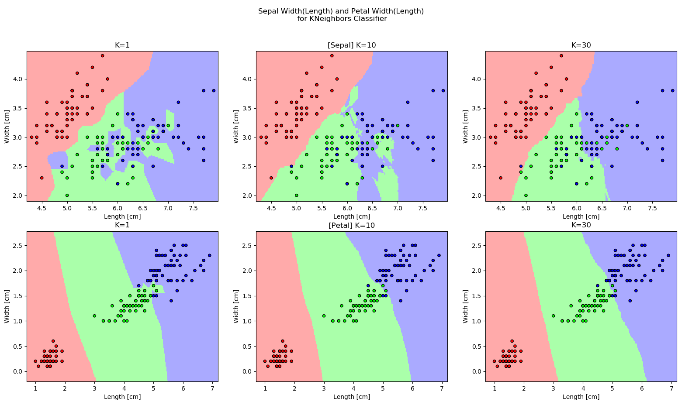
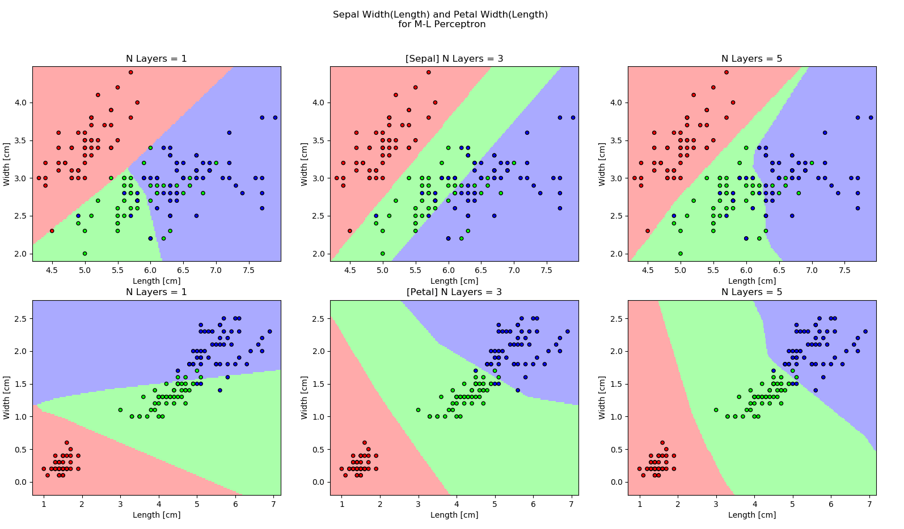

# Iris Species Classification
This small project is an analysis of simple neural network with different classifiers, training algorithms, activation functions, and hidden layers sizes.
The neural network is made with use of [**scikit-learn**](https://github.com/scikit-learn/scikit-learn) library. Additionaly the [**NumPy**](https://github.com/numpy/numpy) and [**Matplotlib**](https://github.com/matplotlib/matplotlib) libraries were used for creating the graphs.

---

## Project description
The data used in the project comes from known "Iris data set". It defines 3 species of Irises (Iris-setosa, Iris-versicolor, Iris-virginicacs) Each of the species is characterised by 4 features (sepal length, sepal width, petal length, petal width).  

The project can also generate two types of graphs - the relationship between the features for different species, and the obtained decision regions for different classifiers and their parameters.

Used classifiers:
- K-nearest neighbors (KNN)
- Simple perceptron
- Multi-layer perceptron (MLP)

The multi-layer perceptron was tested with various parameters:

1. Activation functions
   - relu
   - tanh
2. Learning algorithms:
    - adam
    - sgd
3. Hidden layer numbers:
   - (10)
   - (10, 10)
   - (10, 10, 10)
   - (10, 10, 10, 10)

---

# Results
### Relationship between features for different species

### Decision regions for *K-nearest neighbors* for different K value

### Decision regions for *Multi-layer perceptron* for different hidden layer sizes

### Accuracy for different activation functions and training algorithms 
| Function | Alghorithm | Accuracy |
|----------|------------|----------|
| relu     | adam       | 96.57%   |
| tanh     | adam       | 96.47%   |
| relu     | sgd        | 89.60%   |
| tanh     | sgd        | 94.90%   |

### Accuracy for different number of hidden layers
| Hidden layers    | Accuracy |
|------------------|----------|
| (10)             | 95.80%   |
| (10, 10)         | 96.60%   |
| (10, 10, 10)     | 96.77%   |
| (10, 10, 10, 10) | 96.73%   |
